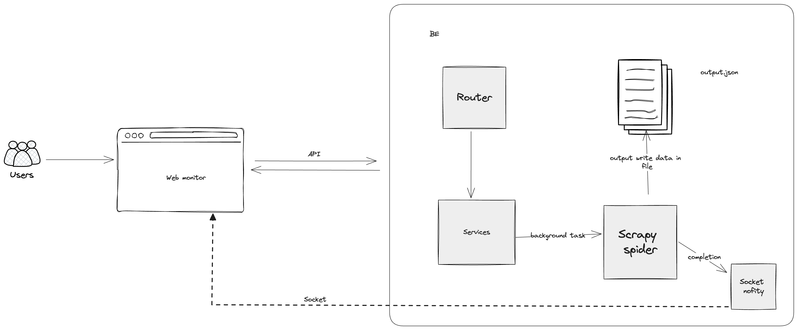

# ytb-crawling

## PROJECT OVERVIEW
YouTube crawler from input one million youtube video urls

## SETUP INSTRUCTION
Step 1
```bash
pip install -r requirements.txt
```
Step 2
```bash
fastapi dev main.py
or
make run-dev
```

## API DOCUMENTATION
Please access below address for API documentation
```bash
http://localhost:8000/docs
or
http://localhost:8000/redoc
```
Docs


Redoc


## ARCHITECTURE


1. Backend
    Technology Choice: FastAPI
    Reasoning: 
        FastAPI is chosen for its high performance, ease of use, and asynchronous capabilities. It allows for the handling of asynchronous tasks, which is crucial for dealing with potentially high traffic and long-running background tasks like crawling.
    Architecture:
        Background Tasks:
            crawl_youtube: Handles URL input and initiates a background task for crawling.
            run_spider: Executes the Scrapy spider to perform the actual crawling. This runs in the background to avoid blocking HTTP requests.
        Middleware:
            CORS Middleware: Allows cross-origin requests, crucial for frontend-backend interactions.
        Security:
            Input Validation: Ensures URLs are well-formed and limits the number of URLs processed to prevent abuse.
        Socket:
            Notification
2. Crawling Workers
    Technology Choice: Scrapy
    Reasoning: 
        Scrapy is a powerful and flexible web scraping framework, ideal for handling large-scale crawling tasks efficiently.
    Architecture:
        Spider:
            Scrapy Spider: Designed to crawl YouTube and extract video data. It reads URLs from a file and writes results to an output file.
        File I/O:
            Temporary Files: URLs are written to a file for Scrapy to read, and results are saved to an output file for further processing.
        Concurrency:
            Scrapy Settings: Configured to handle a large number of concurrent requests, respecting YouTube's rate limits

## SOLUTIONS
1. Python Scrapy Spider with Selenium (simulate real user)
2. youtube-dl / ytb-dlp (Optional, getting blocked sometimes)
3. Combination of Python Scrapy Spider with Selenium + ytb-dlp (Selected)
4. Using youtube-dl / ytb-dlp with rotation user-agent (Considering)