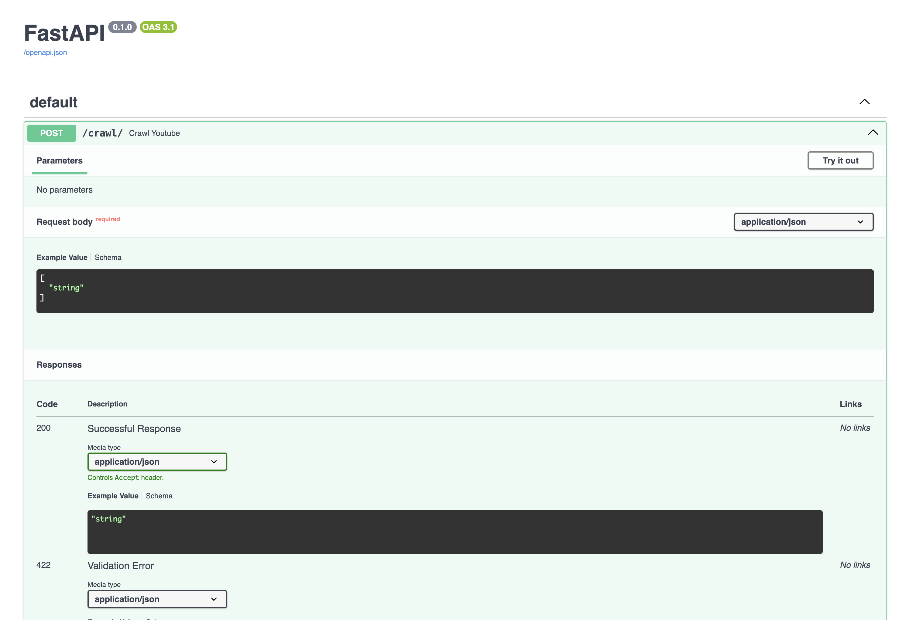
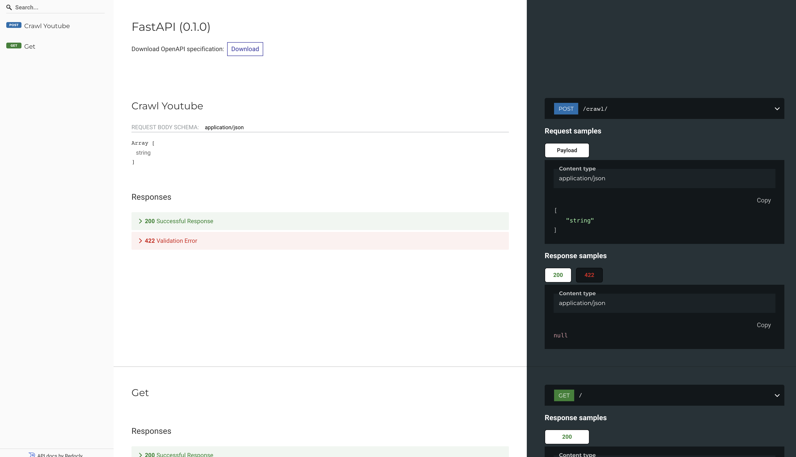

# ytb-crawling

## PROJECT OVERVIEW
YouTube crawler from input one million youtube video urls

## SETUP INSTRUCTION
Step 1
```bash
pip install -r requirements.txt
```
Step 2
```bash
fastapi dev main.py
or
make run-dev
```

## API DOCUMENTATION
Please access below address for API documentation
```bash
http://localhost:8000/docs
or
http://localhost:8000/redoc
```
Docs


Redoc

## ARCHITECTURE
Simply explain


## SOLUTIONS
1. Python Scrapy Spider with Selenium (simulate real user)
2. youtube-dl / ytb-dlp (Optional, getting blocked sometimes)
3. Combination of Python Scrapy Spider with Selenium + ytb-dlp (Selected)
4. Using youtube-dl / ytb-dlp with rotation user-agent (Considering)